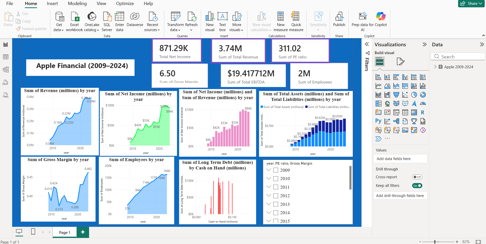

<h1 align="center">🍎 Apple Financial Dashboard (2009–2024)</h1>

An <strong>Interactive Financial Performance Dashboard</strong> built using <strong>Microsoft Power BI</strong> to analyze Apple's financial growth, profitability, assets, liabilities, and workforce trends from <strong>2009 to 2024</strong>.

<h2>📌 Project Overview</h2>

The <strong>Apple Financial Dashboard (2009–2024)</strong> is a business intelligence project developed in <strong>Microsoft Power BI</strong> to visualize and analyze Apple's financial performance over a sixteen-year period.
The dashboard transforms raw financial data into meaningful insights through interactive charts, KPI cards, and dynamic filters.

Designed for business stakeholders, executives, and financial analysts, this dashboard provides a comprehensive view of Apple's financial health by tracking revenue growth, profitability, assets, liabilities, employee expansion, and other important business metrics.

<h2>🎯 Project Objective</h2>

The primary objective of this project is to build an interactive dashboard that enables users to:

<ul>
<li>Monitor Apple's overall financial performance.</li>
<li>Track yearly business growth and profitability.</li>
<li>Analyze long-term financial trends.</li>
<li>Compare multiple financial metrics.</li>
<li>Support data-driven business decisions through interactive visualizations.</li>
</ul>

<h2>🛠 Tools & Technologies</h2>

<ul>
<li>Microsoft Power BI</li>
<li>Power Query</li>
<li>DAX (Data Analysis Expressions)</li>
<li>CSV Dataset</li>
</ul>

<h2>📂 Dataset Information</h2>

The dashboard is built using Apple's financial dataset covering the years <strong>2009–2024</strong>.

<h3>Dataset Includes</h3>

<ul>
<li>Revenue</li>
<li>Net Income</li>
<li>EBITDA</li>
<li>Gross Margin</li>
<li>Total Assets</li>
<li>Total Liabilities</li>
<li>Cash on Hand</li>
<li>Long-Term Debt</li>
<li>Employees</li>
<li>PE Ratio</li>
<li>Financial Year</li>
</ul>

<h2>📊 Dashboard Components</h2>

<h3>🔹 KPI Cards</h3>

The top section of the dashboard displays key financial indicators that provide an instant overview of Apple's business performance.

<table>
<tr>
<th>KPI</th>
<th>Value</th>
</tr>

<tr>
<td>Total Revenue</td>
<td><strong>3.74M</strong></td>
</tr>

<tr>
<td>Total Net Income</td>
<td><strong>871.29K</strong></td>
</tr>

<tr>
<td>Total EBITDA</td>
<td><strong>19.42M</strong></td>
</tr>

<tr>
<td>Gross Margin</td>
<td><strong>6.50</strong></td>
</tr>

<tr>
<td>PE Ratio</td>
<td><strong>311.02</strong></td>
</tr>

<tr>
<td>Total Employees</td>
<td><strong>2M</strong></td>
</tr>

</table>

These KPIs help stakeholders quickly evaluate the company's overall financial position.

<h3>📈 Revenue Trend Analysis</h3>

A line chart visualizes Apple's annual revenue growth from <strong>2009 to 2024</strong>, making it easy to identify long-term business expansion and revenue trends.

<b>Insight:</b>

<ul>
<li>Revenue has consistently increased over the years, reflecting Apple's sustained market growth.</li>
</ul>

<h3>💰 Net Income Analysis</h3>

The dashboard presents yearly Net Income using both line and column charts.
This visualization helps compare annual profitability and highlights periods of significant earnings growth.

<h2>📈 Dashboard Snapshot</h2>

    

<h3>📊 Revenue vs Net Income</h3>

A comparative column chart displays Revenue alongside Net Income, allowing users to evaluate how profitability has changed relative to total revenue over time.

<h3>🏢 Assets vs Liabilities</h3>

A stacked column chart compares:

<ul>
<li>Total Assets</li>
<li>Total Liabilities</li>
</ul>

This comparison helps assess Apple's financial stability and capital structure throughout the years.

<h3>📉 Gross Margin Trend</h3>

A trend chart illustrates changes in Gross Margin over time, enabling users to evaluate operational efficiency and profitability.

<h3>👨‍💼 Employee Growth</h3>

The employee trend chart displays workforce expansion across the selected time period.
This visualization reflects Apple's organizational growth alongside its financial performance.

<h3>💵 Cash on Hand vs Long-Term Debt</h3>

A scatter chart compares Cash on Hand with Long-Term Debt, helping users understand Apple's liquidity position and debt management strategy.

<h2>🎛 Interactive Features</h2>

The dashboard includes interactive slicers that allow users to filter data dynamically.

<h3>Available Filters</h3>

<ul>
<li>Year</li>
<li>PE Ratio</li>
<li>Gross Margin</li>
</ul>

Selecting any filter automatically updates all visuals across the dashboard, providing a fully interactive user experience.

<h2>⚙ Data Preparation</h2>

Before creating the dashboard, the dataset was cleaned and transformed using Power Query.

Data preparation steps included:

<ul>
<li>Removed duplicate records.</li>
<li>Handled missing values.</li>
<li>Removed currency symbols ($).</li>
<li>Removed commas from numerical values.</li>
<li>Converted percentage columns into numeric format.</li>
<li>Changed incorrect data types.</li>
<li>Formatted numerical values for reporting.</li>
<li>Verified data quality and consistency.</li>
</ul>

<h2>📌 Power BI Features Used</h2>

<ul>
<li>KPI Cards</li>
<li>Line Charts</li>
<li>Area Charts</li>
<li>Clustered Column Charts</li>
<li>Stacked Column Charts</li>
<li>Scatter Chart</li>
<li>Interactive Slicers</li>
<li>DAX Measures</li>
<li>Power Query Transformations</li>
<li>Data Modeling</li>
<li>Report Formatting</li>
</ul>

<h2>📈 Business Insights</h2>

<ul>
<li>Apple's revenue demonstrates consistent long-term growth.</li>
<li>Net income has increased significantly across the years.</li>
<li>Gross margin has remained strong with gradual improvements.</li>
<li>Total assets have consistently exceeded total liabilities.</li>
<li>Employee count has expanded steadily, indicating organizational growth.</li>
<li>Cash reserves have remained healthy while maintaining manageable debt levels.</li>
</ul>

<h2>💼 Business Value</h2>

<ul>
<li>Monitor financial performance in real time.</li>
<li>Compare yearly business performance.</li>
<li>Identify long-term financial trends.</li>
<li>Evaluate company profitability.</li>
<li>Analyze asset and liability growth.</li>
<li>Support strategic planning with data-driven insights.</li>
<li>Improve executive reporting through interactive dashboards.</li>
</ul>

<h2>📚 Learning Outcomes</h2>

<ul>
<li>Power BI Dashboard Design</li>
<li>Data Cleaning with Power Query</li>
<li>DAX Calculations</li>
<li>KPI Development</li>
<li>Financial Data Analysis</li>
<li>Time-Series Analysis</li>
<li>Interactive Report Design</li>
<li>Business Intelligence Reporting</li>
<li>Data Visualization Best Practices</li>
</ul>

<h2>📷 Dashboard Preview</h2>

<ul>
<li>KPI Summary Cards</li>
<li>Revenue Trend Analysis</li>
<li>Net Income Analysis</li>
<li>Revenue vs Net Income Comparison</li>
<li>Assets vs Liabilities Analysis</li>
<li>Gross Margin Trend</li>
<li>Employee Growth Analysis</li>
<li>Cash on Hand vs Long-Term Debt Analysis</li>
<li>Interactive Year Slicer</li>
</ul>

<h2>📁 Project Structure</h2>

<pre>
Apple-Financial-Dashboard/
│
├── Apple Financial Dashboard.pbix
├── Apple 2009-2024.csv
├── Dashboard Screenshot.png
├── Apple Financial Dashboard Presentation.pptx
└── README.md
</pre>

<h2>🚀 Future Enhancements</h2>

<ul>
<li>Navigation menu with multiple report pages.</li>
<li>Drill-through reports for detailed financial analysis.</li>
<li>Dynamic tooltips for enhanced user interaction.</li>
<li>Year-over-Year (YoY) growth calculations.</li>
<li>Profit Margin and EBITDA Margin KPIs.</li>
<li>Forecasting using Power BI Analytics.</li>
<li>Mobile-optimized dashboard layout.</li>
</ul>

<h2>👨‍💻 Author</h2>

<b>Sai Lakshmi NandiKatti  </b> 
Aspiring Data Analyst | Power BI Developer | SQL Enthusiast

<h3 align="center">⭐ If you found this project useful, please consider giving this repository a Star on GitHub!</h3>
